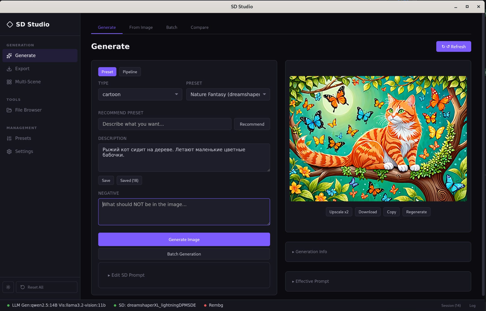
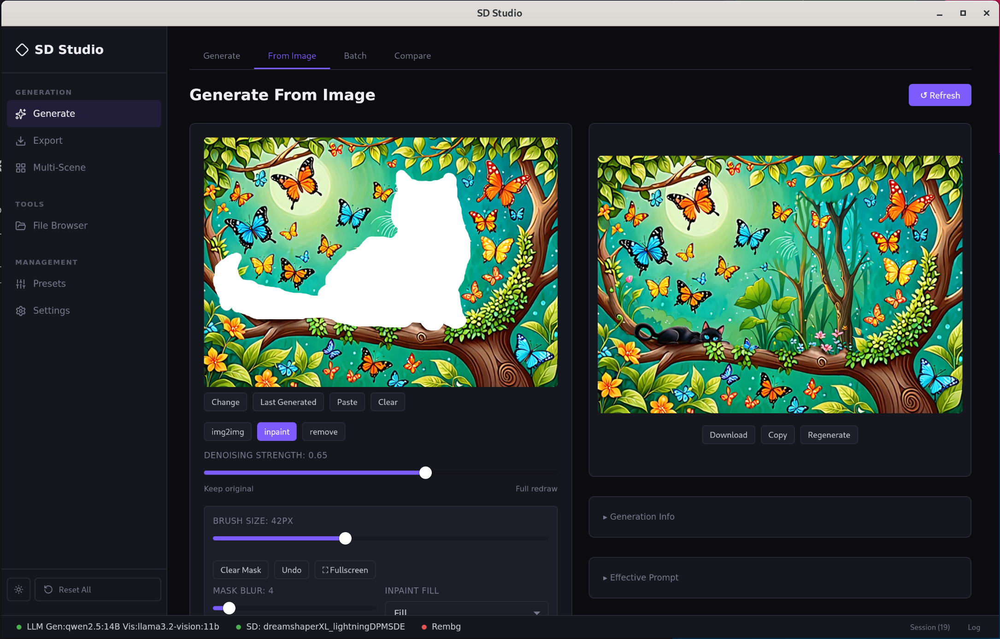
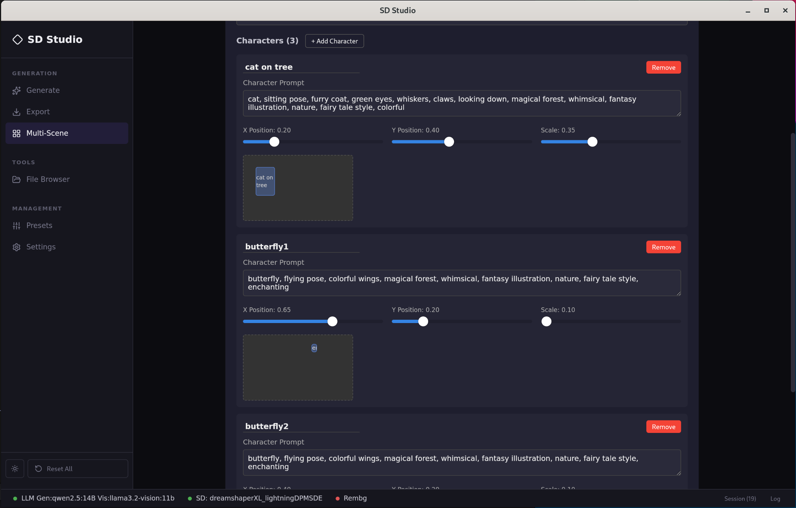
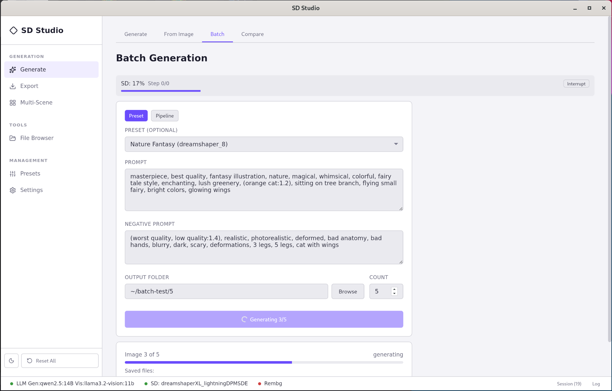

# SD Studio

**Десктоп-приложение для генерации изображений через Stable Diffusion + LLM.**

[English](README.md) | [Changelog](CHANGELOG.md)

SD Studio объединяет локальный Stable Diffusion и LLM в единый воркфлоу: опишите что хотите на обычном языке, получите готовый SD-промпт и сгенерируйте — без ручного набора тегов. Создано для продвинутых пользователей, которые хотят полный контроль над локальным пайплайном.

> **Примечание:** SD Studio подключается к вашему локальному [Stable Diffusion WebUI](https://github.com/AUTOMATIC1111/stable-diffusion-webui) и [OpenAI-совместимому LLM](https://ollama.com). Всё работает на вашем железе — без облака, подписок и передачи данных. Также можно использовать [Stable Diffusion WebUI Forge](https://github.com/lllyasviel/stable-diffusion-webui-forge) для более быстрой генерации (подробнее в [руководстве по настройке](docs/setup-ru.md) и известных ограничениях).

---

## Ключевые возможности

- **LLM-генерация промптов** — опишите на естественном языке, LLM объединит ваш замысел с пресетом в готовый SD-промпт
- **Smart Remove** — нарисуйте маску, LLM проанализирует контекст и автоматически восстановит фон
- **Мульти-сцены** — опишите сцену, LLM разложит на персонажей, композитинг через multi-pass inpaint
- **Пайплайны** — объедините несколько шагов генерации (txt2img → img2img → inpaint) в один воркфлоу
- **Управление сессиями** — организуйте работу в сессии с полной историей генераций
- **Детский режим** — PIN-защита с фильтрацией контента по категориям

## Скриншоты

<p align="center">
  
  
</p>
<p align="center">
  
  
</p>

## Функционал

### Генерация

| Функция | Описание |
|---------|----------|
| Text-to-Image | Генерация из текста с пресетами, LoRA, кастомными сэмплерами |
| Image-to-Image | Преобразование изображений с контролем denoising |
| Inpainting | Canvas-редактор масок с полноэкранным режимом, настройкой кисти, отменой |
| Smart Remove | AI-удаление объектов — нарисуйте маску, контекст автоанализируется LLM vision |
| Пакетная генерация | Генерация N изображений с отслеживанием прогресса |
| Пайплайны | Многошаговые compound-пресеты для сложных воркфлоу |
| Upscale | Режим предпросмотра с однокликным апскейлом до полного разрешения |
| Профили разрешений | Независимые пресеты разрешений в БД, сохраняются между сессиями |
| Профили Hires | Настраиваемые профили hires fix, отключены по умолчанию |
| Импорт/экспорт пайплайнов | Импорт/экспорт конфигураций пайплайнов в JSON |

### Интеграция LLM

| Функция | Описание |
|---------|----------|
| Smart Merge | Описание на естественном языке → объединённый SD-промпт через LLM |
| Анализ изображений | Загрузите изображение, анализ через vision LLM (быстрый или глубокий режим) |
| Рекомендация пресетов | LLM выбирает лучший пресет из библиотеки по описанию |
| Декомпозиция сцен | LLM разбивает описание сцены на отдельных персонажей |
| Настройка инструкций | Редактируйте системный промпт, формирующий формат вывода LLM |

### Воркфлоу и управление

| Функция | Описание |
|---------|----------|
| Сессии | Проектные сессии с полной историей генераций и навигацией |
| Пресеты | Сохранение, организация по типам, импорт/экспорт с валидацией моделей |
| Файловый браузер | Сетка превью, полноэкранный просмотр, быстрая отправка в генерацию |
| Экспорт | Ресайз, конвертация (PNG/JPEG/WebP), контроль качества/интерполяции |
| Сохранённые описания | Переиспользование промптов и описаний между сессиями |
| Светлая/тёмная тема | Системная тема с ручным переключением |

### Безопасность

| Функция | Описание |
|---------|----------|
| Детский режим | PIN-защита, фильтрация контента по категориям, безопасная модификация промптов |

## Требования

### Внешние сервисы

SD Studio подключается к двум сервисам в локальной сети:

- **Stable Diffusion WebUI** (A1111 или [Forge](https://github.com/lllyasviel/stable-diffusion-webui-forge)) — запускается с флагом `--api`. [Руководство по настройке](docs/setup-ru.md). По умолчанию: `http://localhost:7860`
- **LLM API** — любой OpenAI-совместимый сервер: [Ollama](https://ollama.com/), [llama.cpp](https://github.com/ggerganov/llama.cpp) или [LM Studio](https://lmstudio.ai/). По умолчанию: `http://localhost:11434/v1`

Опционально: [Rembg](https://github.com/danielgatis/rembg) для удаления фона в режиме мульти-сцен.

### Разработка

- [Go](https://go.dev/dl/) >= 1.25
- [Node.js](https://nodejs.org/) >= 18
- [Wails CLI](https://wails.io/) v2

| Платформа | Требования |
|----------|-------------|
| macOS | Xcode CLI tools (`xcode-select --install`), 10.15+ |
| Linux | `libgtk-3-dev`, `libwebkit2gtk-4.1-dev` |
| Windows | [WebView2](https://developer.microsoft.com/en-us/microsoft-edge/webview2/) (встроен в Win 10/11) |

## Скачать

Готовые сборки доступны на [странице релизов](https://github.com/Zazza/sd-ai/releases).

## Быстрый старт

```bash
# Установка Wails CLI
go install github.com/wailsapp/wails/v2/cmd/wails@latest

# Клонирование и запуск
git clone https://github.com/Zazza/sd-ai.git
cd sd-ai
make setup   # первый запуск: загрузка зависимостей
make dev     # запуск с hot-reload
```

Frontend hot-reload на `http://localhost:34115`.

### Сборка

```bash
make build   # production-бинарник → build/bin/sd-studio
```

### Docker

```bash
docker compose up --build
```

## Стек

| Слой | Технология |
|------|-----------|
| Backend | Go 1.25 |
| Desktop | [Wails](https://wails.io/) v2 |
| Frontend | Vue 3 + Vite |
| БД | SQLite (pure Go, без CGo) |
| LLM | OpenAI-совместимый API |
| Генерация | Stable Diffusion WebUI API |

## Как это работает

```
Пользователь пишет описание на естественном языке
         │
         ▼
  LLM Smart Merge
  (описание + пресет + инструкция → SD-промпт)
         │
         ▼
  Генерация через Stable Diffusion WebUI
         │
         ▼
  Предпросмотр → Upscale → Экспорт
```

**From Image:** Загрузка → Vision LLM анализирует → Inpaint/Remove с редактором масок

**Мульти-сцены:** Описание сцены → LLM декомпозирует → Multi-pass inpaint композитинг

**Smart Remove:** Рисование маски → LLM vision анализирует контекст → Авто-inpaint фона

## Структура проекта

```
├── main.go              # Entrypoint
├── app.go               # Wails RPC bindings
├── internal/
│   ├── config/          # Конфигурация
│   ├── llm/             # LLM клиент
│   ├── preset/          # SQLite CRUD
│   ├── sd/              # Stable Diffusion клиент
│   ├── compositor/      # Мульти-сцены
│   ├── kids/            # Детский режим
│   ├── rembg/           # Удаление фона
│   ├── logger/          # Логирование
│   └── api/             # HTTP API
├── frontend/
│   └── src/
│       ├── components/  # Vue компоненты
│       └── wailsjs/     # Автогенерированные Wails bindings
└── data/                # Runtime-данные (SQLite, пресеты)
```

## Лицензия

[GNU Affero General Public License v3.0](LICENSE)
